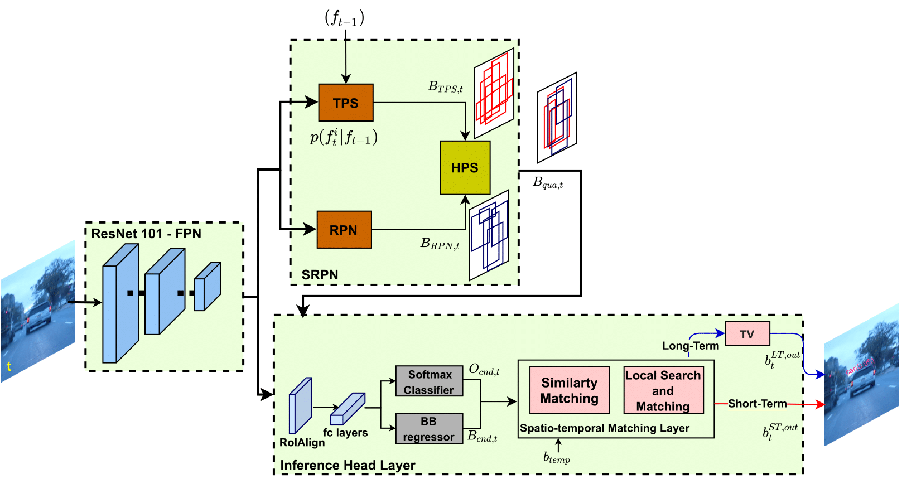

# TDIOT: Target-driven Inference for Deep VideoObject Tracking

This repository provides the implementation of our paper [**TDIOT: Target-driven Inference for Deep VideoObject Tracking**](https://ieeexplore.ieee.org/document/9540797/keywords#keywords) (Fiiz Gurkan, Llukman Cerkezi, Ozgun Cirakman and Bilge Gunsel)


Link for the demo videos for both VOT2016 and VOT2018 datasets (YouTube playlist):

https://www.youtube.com/watch?v=xMl3hOpShvM&list=PLMzonaXew-57vKDbiR0xoTurw22lYVWBw




## Setup (with Anaconda)

### Install dependencies

The code is tested with CUDA 10.1 on Linux. 
Note that the code also can run without gpu. 
You need to download [Mask R-CNN pretrained weights](https://github.com/matterport/Mask_RCNN/releases) and place it to the mrcnn folder.

Required packages:

 * tensorflow (gpu-optional) = 1.3

 * Keras = 2.0.8
 
 * PyTroch (CPU) = 1.5
 
 * scikit-image
 
 * opencv
 
 * got10k
 
 * ipython
 
 * seaborn
 
 * h5py=2.10.0
 

## To run the code

You can run the code for two differeent scanerios: short term and long term.

After you run the code you will get results in *output* folder in text file format.
In each row you will get (x,y) - top lef corner and (w,h)-width and height of the object. 

### Long Term (LT) Tracking
 Run the following 

```
python test_tdiot.py --img_path sample_data/ball1_img/ --gt_bbox_path sample_data/ball1_gt/ --object_name ball --auxiliary_tracker SIAM --long_term --exp_name ball_test
```

### Short Term (ST) Tracking
 Run the following 

```
python test_tdiot.py --img_path sample_data/ball1_img/ --gt_bbox_path sample_data/ball1_gt/ --object_name ball --auxiliary_tracker SIAM  --exp_name ball_test
```

## Publication
 If you use this software in your research, please cite our publication:

```
@ARTICLE{tdiot_2021_ieeeTIP,
  author={Gurkan, Filiz and Cerkezi, Llukman and Cirakman, Ozgun and Gunsel, Bilge},
  journal={IEEE Transactions on Image Processing}, 
  title={TDIOT: Target-driven Inference for Deep Video Object Tracking}, 
  year={2021},
  volume={30},
  pages={7938 - 7951},
  doi={10.1109/TIP.2021.3112010}}
```

## Credits

Mask R-CNN and pretrained weights are based on [here](https://github.com/matterport/Mask_RCNN).

KCF code is based on [here](https://github.com/fengyang95/pyCFTrackers).

SiamFC code and the weights are based on [here](https://github.com/huanglianghua/siamfc-pytorch).
